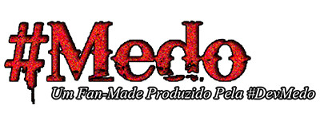
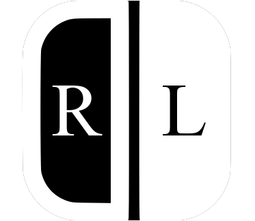
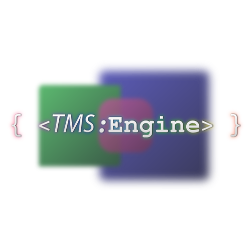
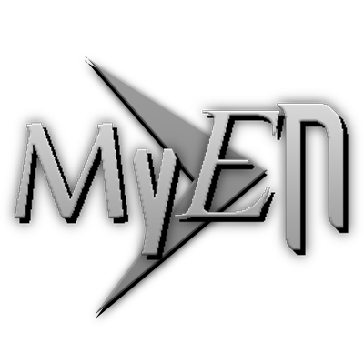
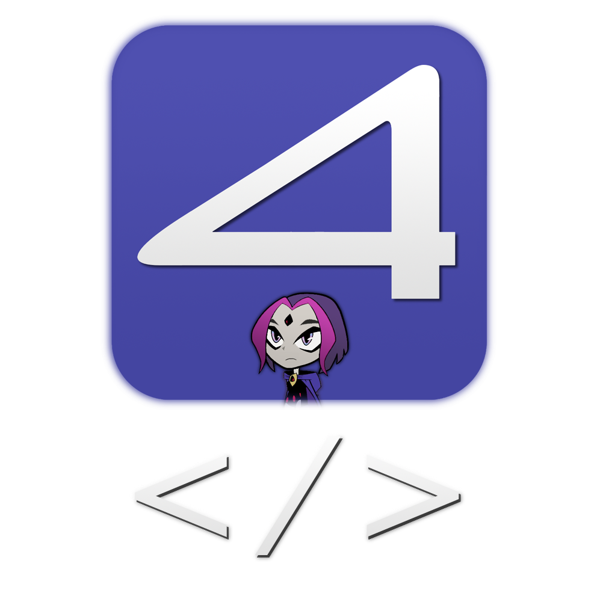

<h1 align="center">
   
  💜 - Hello Sweeties - 💜
</h1>

I'm *TheMitoSan¹*, creator of [R3ditor](https://github.com/themitosan/R3ditor), [R3ditor V2 (aka. R3V2)](https://github.com/themitosan/R3ditor-V2) and [fpPS4 Temmie's Launcher](https://github.com/themitosan/fpPS4-Temmie-s-Launcher).

My life goal is making apps / tools and games using web-technology as offline it can be² - __without any usage / assistance of generative AI__.

I started my dev journey using *Visual Studio 6.0* but then I moved to web development because even back then, I knew that the future lies on the web.

Today I'm working on a new app / template³ called **"TMS Engine"** - a modular application written using TS, Webpack that will allow me writting new apps / tools (or even games) on future with more ease and **without** common interface modules *(like React, Vue, Svelt JS, Bootstrap or even jQuery)* - Running on [nwjs](https://nwjs.io/).

If you have any doubts about any of my projects or just want to have a nice conversation - you can call me on my **[Twitter](https://twitter.com/themitosan)**.

#

<h4 align="center">

 

*Here is a list of apps / games / tools that I created*

</h4>

#
*¹ - Formerly known as TemmieHeartz.*

*² - I know that today it's very rare not having any kind of connection and is kinda controverse making web-apps that **must** offline but... In the end, the back-end world can be as colorful as you want paint it - with all rainbows and stuff... Until you get offline! :v*

*³ - What ~(weirdly)~ is called today as "Biolerplate". **It's a Template** - Nothing more, nothing less.*
